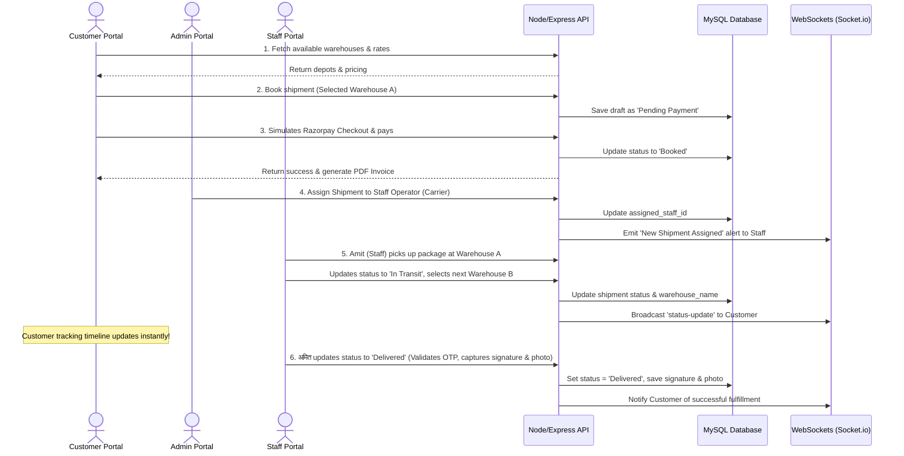

# SmartShip — Enterprise Role-Based Logistics & Fleet Management System

SmartShip (Marine Bytes) is a production-grade, role-based shipping, logistics, and fleet tracking platform. The application manages the complete lifecycle of cargo transit, including parcel booking, dynamic tariff calculations, payment simulation, automatic PDF invoice generation, real-time tracking, and automated AI client support.

---

## 🛠️ Technology Stack & Architecture

SmartShip is designed using a decoupled Client-Server architecture:

### 💻 Frontend (Client Portal)
*   **Framework**: React.js (Vite)
*   **Styling**: Vanilla CSS & Tailwind CSS for a premium, clean Light Mode UI
*   **State & Real-time**: Socket.io-client (WebSockets connection for live tracking)
*   **Charts**: Recharts (for executive analytics dashboard)
*   **Maps**: Leaflet (interactive route visualization & transit coordinate tracking)
*   **Icons & Toast alerts**: Lucide React & React Hot Toast

### ⚙️ Backend (Server API)
*   **Runtime & Server**: Node.js & Express.js
*   **Real-time Communication**: Socket.io (WebSocket rooms for shipments & support chats)
*   **Authentication & Security**: JWT (JSON Web Tokens) with Bcryptjs password hashing, Helmet security headers, Morgan logger
*   **Document Generation**: PDFKit (dynamic creation of commercial invoice PDFs)

### 🗄️ Database Management
*   **Database Engine (MySQL)**: Standard database connection using `mysql2/promise` connection pool. Handles all relational records, including Users, Shipments, Fleet Registry, Warehouses, Chat history, Notifications, Addresses, and Support tickets, with auto-creation of tables and fields on startup.
*   **Auto-Seeding**: A seeder script (`seeder.js`) runs automatically when the database is empty, loading default admin, staff, customer profiles, warehouses, and fleet vehicles.

---

## 🔑 Role-Based Access Control (RBAC)

The system features three distinct user portals:

### 👤 1. Customer Portal (Book & Track)
*   **Shipping Estimator**: Calculates transit durations instantly using origin/destination cities, shipment type, and weight.
*   **Draft Booking**: Saves package dimensions, sender phone, consignment category, declared value, metal scan alerts, and customs info.
*   **Depot Selection**: Allows customers to select their preferred initial registered warehouse depot from a dynamic list.
*   **Mock Razorpay Integration**: Emulates a secure payment process, generating commercial PDF invoices upon success.
*   **Live Tracking Timeline**: Displays a real-time status tracker stepper with coordinates, transit velocity, and timeline history log sync.
*   **Support System**: Open support tickets and chat in real-time with staff or get automated answers from the **AI Chatbot**.
*   **Address Book Manager**: Customers can save frequently used delivery profiles.

### 👥 2. Staff Portal (Logistics Carriers)
*   **Assigned Daily Task Checklist**: Displays assigned pending shipments, ordered by their current stage in the transit pipeline.
*   **Transit Progress Stepper**: Enables carriers to advance parcel status:
    `Booked` ➔ `Picked up` ➔ `In Transit` ➔ `Out for Delivery` ➔ `Delivered`
*   **Warehouse Location Pre-fill**: Staff can select a registered warehouse to automatically populate the current hub/location field.
*   **Verification Security**: 
    *   Generates and validates a **6-digit Delivery OTP** when moving to the final delivery stage.
    *   Captures recipient's signature (canvas drawing) and uploads a **proof of delivery photo**.
*   **Logistics Registry**: Read-only access to warehouse load occupancy meters and fleet registry statuses.

### 👑 3. Administrator Portal (Executive Command Center)
*   **Executive Dashboard**: Tracks gross revenue metrics, active transit cargo, staff performance, and ticket backlogs.
*   **Fulfillment Desk**: Registry control room to manually assign newly booked cargo drafts to available logistics staff.
*   **Tariffs & Rates Settings**: Adjust pricing formulas (Base Fare, GST, Cost per KG, Express/Air/Ocean multipliers) in real-time.
*   **Logistics & Fleet Registration**: Add new warehouses (setting max storage capacity) and register transport vehicles (Cargo Planes, Container Ships, Express Vans).
*   **Operator Registration**: Create and monitor log profiles for field staff operators.

---

## 🔄 End-to-End Shipment Workflow

The diagram below illustrates how components interact during a shipment lifecycle:



---

## 📂 Project Directory Structure

```text
├── client/                     # React Frontend (Vite)
│   ├── src/
│   │   ├── components/         # GuardedRoute.jsx (RBAC protection)
│   │   ├── context/            # Global contexts (AuthContext.jsx, SocketContext.jsx)
│   │   ├── pages/              # Portals and logins
│   │   │   ├── WelcomePage.jsx       # Public landing page
│   │   │   ├── PortalSelectPage.jsx  # Role selector route
│   │   │   ├── CustomerDashboard.jsx # Client booking, tracking & support
│   │   │   ├── StaffDashboard.jsx    # Carrier daily task checklists
│   │   │   └── AdminDashboard.jsx    # Executive control desk
│   │   └── index.css           # Global theme styling, custom animations & mode tokens
│   └── vite.config.js          # Vite build parameters & port mappings
│
├── server/                     # Express.js backend & Socket.io server
│   ├── config/
│   │   └── db.mysql.js         # Connection pool setup & automatic schema migration
│   ├── controllers/            # Controller logic (Auth, Logistics, Shipment, Payments)
│   ├── middleware/             # Route protection, RBAC filters, rate limiters
│   ├── routes/                 # Express route mappings
│   ├── utils/
│   │   ├── communication.js    # Simulated SMS (Twilio) & Email (Nodemailer) notifications
│   │   └── seeder.js           # Seeds default warehouses, rates, and users
│   └── server.js               # Entrypoint, WebSocket logic & port listener
│
├── run.ps1                     # Unified Powershell launcher
└── README.md                   # Technical documentation
```

---

## ⚡ Setup & Execution Instructions

### Prerequisites
Make sure you have Node.js (v16+) and MySQL Server running on your local machine.

### Automatic Execution (Recommended)
Open a terminal in the root workspace and run:
*   **PowerShell**:
    ```powershell
    .\run.ps1
    ```
*   **Command Prompt**:
    ```cmd
    run.bat
    ```
*The script installs all backend/frontend packages, configures databases, and starts development servers concurrently.*

### Manual Execution

1.  **Start MySQL Server** and ensure a database named `smartship` exists (or update the credentials in `server/.env`).
2.  **Run Server**:
    ```bash
    cd server
    npm install
    npm run dev
    ```
    *Runs on `http://localhost:5000`*
3.  **Run Client**:
    ```bash
    cd client
    npm install
    npm run dev
    ```
    *Runs on `http://localhost:5173`*

---

## 🔑 Seeded Test Profiles

Use these accounts to test the different role permissions:

| Portal | Email ID | Password | Role Description |
| :--- | :--- | :--- | :--- |
| **Administrator** | `admin@shiptrack.com` | `Admin@123` | Control settings, rates, registrations & desks |
| **Staff Operator** | `staff1@shiptrack.com` | `Staff@123` | Task pipelines, OTP verifies, delivery uploads |
| **Customer** | `customer1@shiptrack.com` | `Customer@123` | Bookings, rate check, tickets, invoice downloads |
