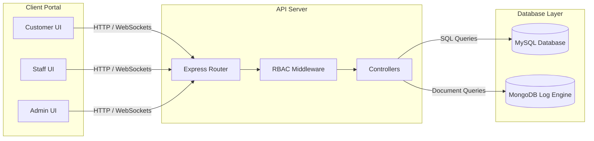

# Industrial Project Report

**(Internship Semester Jan-June 2024)**

---

# SMART SHIP: ENTERPRISE ROLE-BASED LOGISTICS & FLEET MANAGEMENT SYSTEM

---

**Submitted in partial fulfillment of the requirements for the degree of**
**Bachelor of Technology (B.Tech) in Computer Science and Engineering**

**By**
**[Student Name]**
**Regn. No. [Student Registration Number]**

 

  <!-- Placeholder for JECRC or Company Logo -->
  <h3>[Logo of JECRC University / Company]</h3>
  <h2>JECRC UNIVERSITY, JAIPUR</h2>
  <h3>Department of Computer Science and Engineering</h3>
  <h3>June 2024</h3>

 

---

## Under the Guidance of

**Faculty Internship Guide**
*   **Name**: [Faculty Guide Name]
*   **Designation**: [Faculty Guide Designation]
*   **Department**: Computer Science and Engineering
*   **Institution**: JECRC University, Jaipur

**Industry Guide**
*   **Name**: [Industry Guide Name]
*   **Designation**: [Industry Guide Designation]
*   **Company**: SmartShip Logistics (Marine Bytes)
*   **Location**: [Company Location]

---
\pagebreak

## Declaration

I hereby declare that the project work entitled **"SmartShip: Enterprise Role-Based Logistics & Fleet Management System"** is an authentic record of my own work carried out at **SmartShip Logistics (Marine Bytes)** as requirements of the six months industrial project for the award of the degree o
| `name` | VARCHAR(255) | - | NOT NULL | Address label (e.g. 'Home', 'Office') |
| `phone` | VARCHAR(50) | - | NOT NULL | Contact number |
| `address` | TEXT | - | NOT NULL | Full address |
| `city` | VARCHAR(255) | - | NOT NULL | City name |
| `pincode` | VARCHAR(20) | - | NOT NULL | Postal index code |
| `created_at` | TIMESTAMP | Default: CURRENT_TIMESTAMP | NOT NULL | Creation date |

### 9. Support Tickets Table (`tickets`)
Funnels customer issues to support personnel.

| Field Name | Data Type | Key / Constraint | Nullability | Description / Purpose |
| :--- | :--- | :---: | :---: | :--- |
| `id` | VARCHAR(36) | Primary Key | NOT NULL | Unique UUID string |
| `user_id` | VARCHAR(36) | Foreign Key -> `users.id` | NOT NULL | Author reference |
| `sender_name` | VARCHAR(255) | - | NOT NULL | Display name |
| `sender_role` | VARCHAR(50) | Default: 'customer' | NOT NULL | Role of creator |
| `category` | VARCHAR(100) | Default: 'General' | NOT NULL | Classification (e.g. 'Delay', 'Billing') |
| `title` | VARCHAR(255) | - | NOT NULL | Ticket summary title |
| `message` | TEXT | - | NOT NULL | Detailed description |
| `screenshot` | LONGTEXT | - | NULL | Attachment image (Base64) |
| `status` | VARCHAR(50) | Default: 'open' | NOT NULL | Status ('open', 'resolved', 'closed') |
| `created_at` | TIMESTAMP | Default: CURRENT_TIMESTAMP | NOT NULL | Creation date |

### 10. Chat Messages Table (`chat_messages`)
Stores communication logs between customer service agents and users.

| Field Name | Data Type | Key / Constraint | Nullability | Description / Purpose |
| :--- | :--- | :---: | :---: | :--- |
| `id` | VARCHAR(36) | Primary Key | NOT NULL | Unique UUID string |
| `room_id` | VARCHAR(100) | Index | NOT NULL | Chat room ID |
| `sender_id` | VARCHAR(100) | - | NOT NULL | Sender ID or 'ai-assistant' |
| `sender_name` | VARCHAR(255) | - | NOT NULL | Sender name |
| `sender_role` | VARCHAR(50) | - | NOT NULL | Role ('customer', 'staff') |
| `message` | TEXT | - | NOT NULL | Chat message text |
| `created_at` | TIMESTAMP | Default: CURRENT_TIMESTAMP | NOT NULL | Sent timestamp |

### 11. Referrals Table (`referrals`)
Manages referral sign-ups and reward points.

| Field Name | Data Type | Key / Constraint | Nullability | Description / Purpose |
| :--- | :--- | :---: | :---: | :--- |
| `id` | VARCHAR(36) | Primary Key | NOT NULL | Unique UUID string |
| `user_id` | VARCHAR(36) | Foreign Key -> `users.id` | NOT NULL | Referrer ID |
| `referral_code`| VARCHAR(20) | Index | NOT NULL | Referenced code |
| `referred_email`| VARCHAR(255) | - | NULL | Invited user email |
| `referred_name`| VARCHAR(255) | - | NULL | Invited user name |
| `reward_earned`| DECIMAL(10,2) | Default: 0.0 | NOT NULL | Credited amount |
| `status` | VARCHAR(50) | Default: 'pending' | NOT NULL | Status ('pending', 'completed') |
| `created_at` | TIMESTAMP | Default: CURRENT_TIMESTAMP | NOT NULL | Referral date |

### 12. Reward Logs Table (`rewards`)
Logs reward transactions and point balances.

| Field Name | Data Type | Key / Constraint | Nullability | Description / Purpose |
| :--- | :--- | :---: | :---: | :--- |
| `id`
| **TC-034** | Admin Portal | Block customer account | Admin sets `is_blocked = 1` | User is blocked from logging in | Account blocked | PASS |
| **TC-035** | Database | Automatic schema initialization | Application server starts up | Tables automatically created if not existing | Tables created, seed data loaded | PASS |

---
\pagebreak

# References and Bibliography

1.  **Elmasri, R. and Navathe, S.B.**, 2017. *Fundamentals of Database Systems*. 7th ed. Boston: Pearson.
2.  **Flanagan, D.**, 2020. *JavaScript: The Definitive Guide*. 7th ed. Sebastopol: O'Reilly Media.
3.  **React Documentation**, 2024. *React Reference Documentation*. [online] Available at: <https://react.dev/> [Accessed 15 April 2024].
4.  **Express.js Documentation**, 2024. *Express Guide*. [online] Available at: <https://expressjs.com/> [Accessed 20 April 2024].
5.  **MySQL 8.0 Reference Manual**, 2024. *MySQL Reference*. [online] Available at: <https://dev.mysql.com/doc/refman/8.0/en/> [Accessed 25 April 2024].
6.  **Socket.io API Docs**, 2024. *Socket.io Reference Guide*. [online] Available at: <https://socket.io/docs/v4/> [Accessed 2 May 2024].
7.  **Leaflet.js Reference**, 2024. *Leaflet API Reference*. [online] Available at: <https://leafletjs.com/reference.html> [Accessed 10 May 2024].
8.  **PDFKit Guide**, 2024. *PDFKit PDF Generation Library*. [online] Available at: <https://pdfkit.org/> [Accessed 12 May 2024].
9.  **Bcrypt.js Reference**, 2024. *Bcrypt.js NPM Repository*. [online] Available at: <https://www.npmjs.com/package/bcryptjs> [Accessed 15 May 2024].
10. **IEEE Computer Society**, 1998. *IEEE Std 830-1998, IEEE Recommended Practice for Software Requirements Specifications*. New York: IEEE.

## 2.4 Data/System Analysis and Design
The system uses a decoupled client-server architecture:

---

## 2.5 UML & Design Diagrams
---

## 3.2 MongoDB Supplementary Models
In addition to MySQL, SmartShip uses MongoDB as a secondary datastore to log notification events and temporary data.

### 1. Notifications Log System
Saves notifications generated during shipment updates.
*   **Fields**: `id` (String), `user_id` (String), `title` (String), `message` (String), `type` (String), `shipment_id` (String), `is_read` (Boolean), `created_at` (Date).

### 2. Live Coordinate Logs
Maintains real-time location histories for tracking active shipments.
*   **Fields**: `tracking_id` (String), `coordinates` (Array of [Lat, Lng]), `velocity_kmh` (Number), `heading_degrees` (Number), `recorded_at` (Date).

---
\pagebreak
